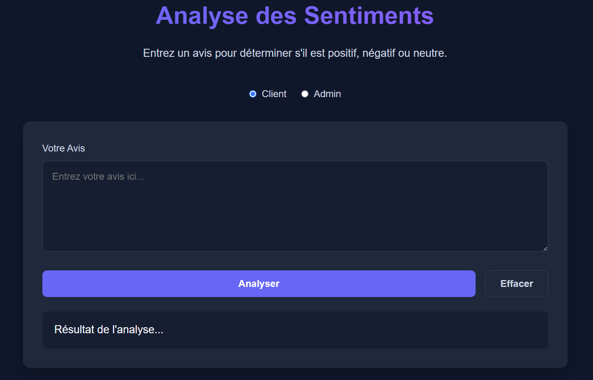
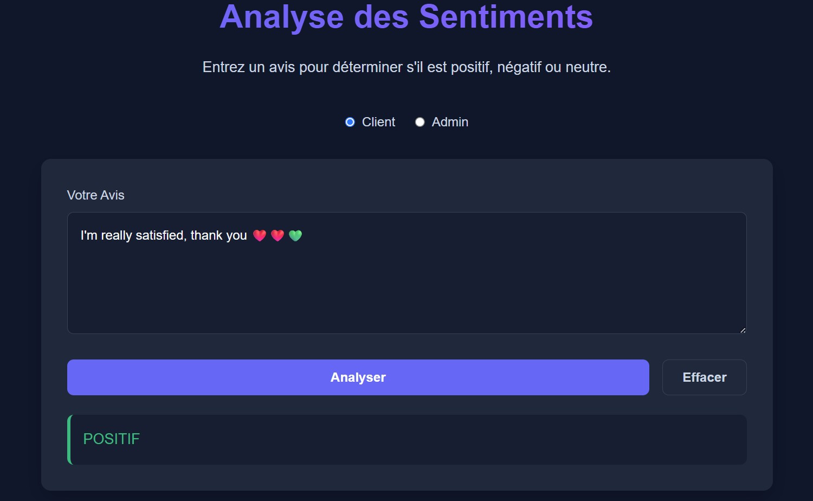
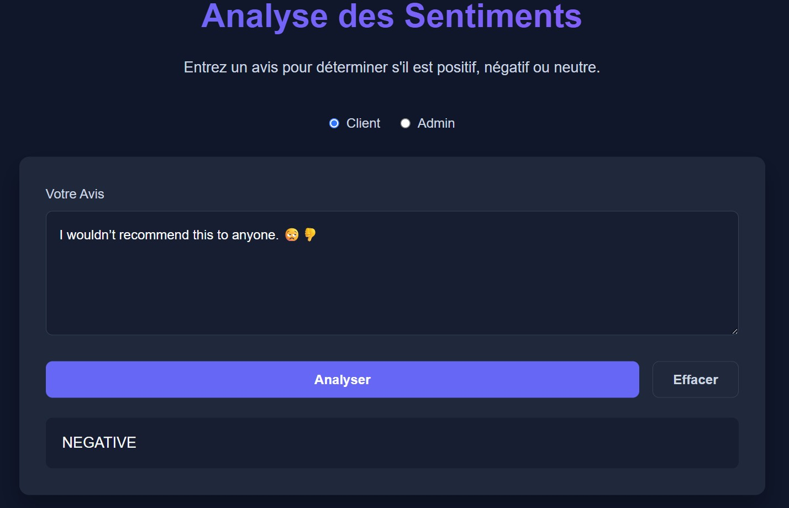
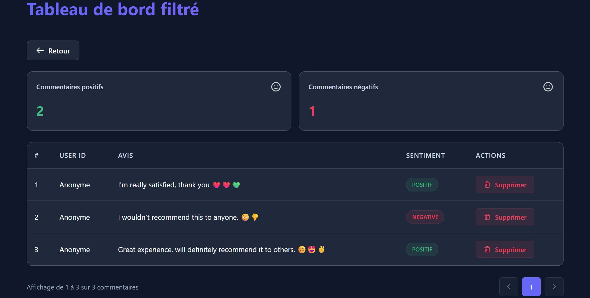

🧠 Classification de Commentaires avec BERT & FastAPI
Ce projet vise à développer une application de classification automatique de commentaires textuels (analyse de sentiments ou modération de contenu) en combinant des techniques de NLP avec un modèle BERT, le tout intégré dans une API web via FastAPI.Il intègre également un système de monitoring en temps réel avec Prometheus, Grafana et Weights & Biases (wandb) pour le suivi des performances.

---

📌 Objectifs

Prétraitement et nettoyage des données textuelles.
Entraînement d’un modèle NLP basé sur BERT pour la classification.
Déploiement d’une API RESTful avec FastAPI.
Monitoring système et applicatif (temps de réponse, usage CPU/RAM, nombre de prédictions, etc.).
Reproductibilité et portabilité grâce à Docker et DVC.

---

🛠️ Technologies Utilisées

| Technologie       | Rôle                                                        |
|-------------------|-------------------------------------------------------------|
| 🤖 BERT / Transformers | Modèle NLP de classification basé sur le langage        |
| ⚡ FastAPI         | Backend de l'API RESTful                                    |
| 🐍 Python         | Langage principal                                            |
| 🐳 Docker / Compose | Conteneurisation et orchestration                         |
| 📈 Prometheus     | Collecte des métriques système et applicatives              |
| 📊 Grafana        | Visualisation des métriques                                 |
| 🧪 wandb          | Suivi des expériences et performance du modèle              |
| 🧬 DVC            | Gestion des versions de données et modèles                  |

---

📁 Structure du Projet


---

🏗️ Schéma de l'Architecture


---

## 🖥️ Interface Utilisateur

Voici un aperçu de l’interface graphique de notre application :

- **Page d'accueil :**  

  

- **Résultat de prédiction positif :** 

  

- **Résultat de prédiction négatif :**  

  

- **Espace administrateur :** 

  

- - **Résultat filtré :**  

  

---

⚙️ Installation & Lancement
1. Cloner le dépôt
git clone https://github.com/Hassanadn/classification-commentaires.git
cd classification-commentaires

2. Lancer les services avec Docker
```bash
docker-compose up --build
```

- ✅ L'API sera accessible à : http://localhost:8000
- 📄Documentation Swagger : http://localhost:8000/docs

3. Arrêter les services
```bash
docker-compose down
```


🌐 Accès aux Interfaces


🧠 API FastAPI
http://localhost:8000
```bash
username : mlops
password: mlops
```
Identifiants par défaut (à modifier)

API de classification des commentaires


📄 Swagger
http://localhost:8000/docs
Documentation interactive de l'API


📡 Prometheus
http://localhost:9090
Visualisation des métriques brutes


📊 Grafana
http://localhost:3000
Dashboards personnalisés


🎛️ Grafana Login
```bash
admin / admin
```
Identifiants par défaut (à modifier)


📊 Supervision avec Prometheus & Grafana
L’application expose des métriques via l’endpoint /metrics pour être collectées par Prometheus.
Métriques système :

💻 Utilisation CPU
📈 Consommation mémoire
🌐 Activité réseau

Métriques applicatives :

📦 Nombre total de requêtes
⏱️ Temps moyen de prédiction
🧠 Nombre de prédictions par classe (positif, négatif, neutre)


📈 Suivi des Expériences avec wandb
Chaque entraînement de modèle est suivi avec Weights & Biases :
- 📉 Courbes de perte
- 🎯 Précision
- ⚖️ F1-score 
- 🔀 Matrice de confusion, etc.

Connecte-toi avec ton compte wandb :
import wandb
wandb.login()


📦 Versionnage avec DVC
Utilise DVC pour versionner les datasets et modèles :
dvc init
dvc add data/train.csv
dvc push


📮 Exemple d’Utilisation de l’API
```bash 
curl -X POST "http://localhost:8000/predict" \
  -H "Content-Type: application/json" \
  -d '{"text": "This product is incredible, I recommend it!"}'
```
Expected response:
```json
{
  "label": "positive"
}
```

👨‍💻 Auteurs

- ADNAN Hassan
- EL ATRACH Abdellah
- OUHMAD Hadda
- EDDREG Khadija


Projet réalisé dans le cadre du Master Data Science – 2025
